# M3

### Deployment
For this milestone, we focus on the deployment process and assume that once a commit is pushed to Git then all the build and test processes finish successfully. With the new push, DockerHub will pull directly from GitHub and build a new docker image base on the branch. Each branch is corresponding to an image tag, e.g. master -> stable, canary -> canary.

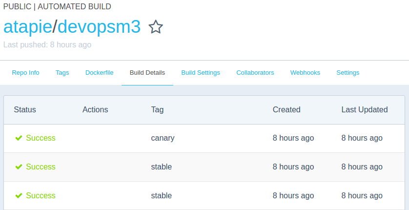

After the docker image is built, DockerHub will call a web hook to trigger the deployment of newly built image (see rolling.js). This web hook is run on a single AWS EC2 instance and is configured with all necessary credentials to manage the Kubernetes cluster. The script rolling.js simply check the new image and do a rolling update to the corresponding replication controllers of Kubernetes. For example:

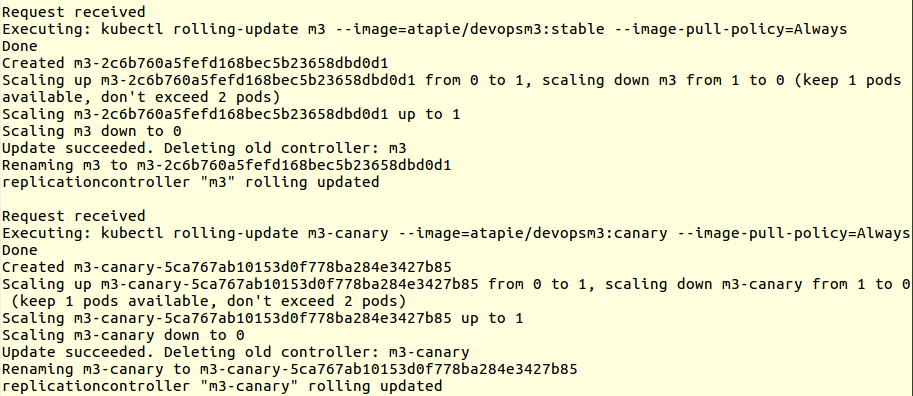

### Configure a production environment automatically
We use Kubernetes on AWS to manage the production environment. The config script can be found in [yaml/](yaml/):
  - node.js, source code: built directly into docker images
  - Load balancer: using Kubernetes external service and replication controllers
  - Redis: using Kubernetes internal service and replica set (newer version of replication controller)

### Alerts
We use a node.js code that is running in background to minitor CPU and memory usage. This program will be deployed in every container. Once a predetermined rule is triggerred, i.e. CPU usage is greater than 70% or available memory is less than 100MB, an email will be sent out from the corresponding instance.
Email sent from the container:

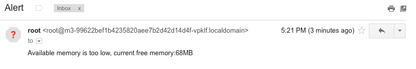

Metric being monitored:

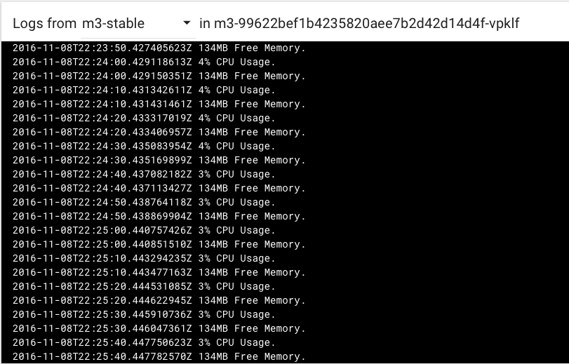

### Autoscale
Every service in Kubernetes can be scaled automatically. For this milestone we configure autoscale for stable branch replication controller based on CPU usage. See [yaml/autoscale.yaml](yaml/autoscale.yaml). However, since the CPU usage is very low, the RC starts with 3 replicas but always scales down to 1 replica (min=1, max=10).

~~~
apiVersion: autoscaling/v1
kind: HorizontalPodAutoscaler
metadata:
  name: m3-scaler
spec:
  scaleTargetRef:
    kind: ReplicationController
    name: m3
  minReplicas: 1
  maxReplicas: 10
  targetCPUUtilizationPercentage: 50
~~~

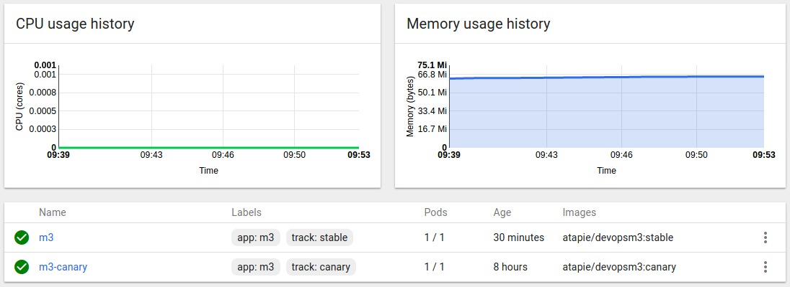

### Feature flags
The feature flag will toggle the set function:

#### Before feature flag:
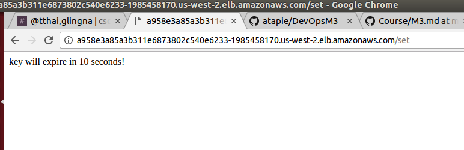

#### Use feature flag to toggle set function:
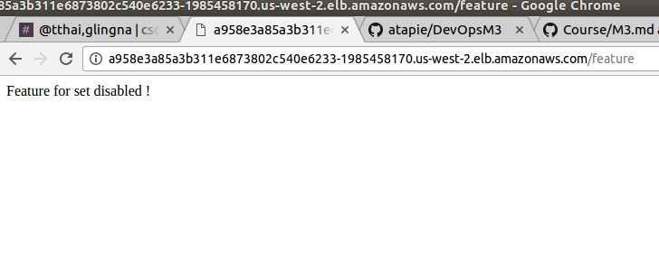

#### Set function has been toggle and disabled in this case:
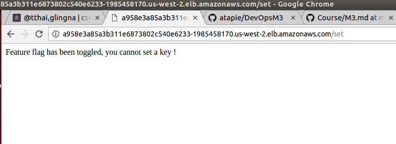

### Canary release
For canary release, the same external service of the app matches two different replication controllers (same app label but different track labels). The load balancing depends on how many replicas each RC has. In this milestone we configure the stable RC to autoscale between 1 to 10 replicas while the canary RC only has 1 replica.

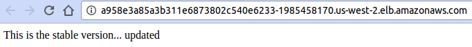
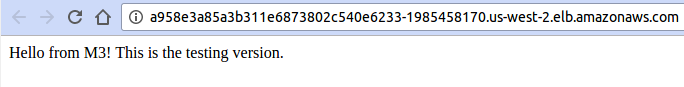

The canary part also has a period liveness check, if there is an error (e.g. HTTP code 500) then the container is restarted.
  - If there is a serious bug (always error) then the canary container is restarted continuously and hence it's inaccessible and requires a rollback to a previous version.
  - If the error is temporary (e.g. database error) then the system can recover after sometime without any action.

~~~
livenessProbe:
  httpGet:
    path: /
    port: 8080
  initialDelaySeconds: 15
  timeoutSeconds: 1
~~~

Continuous restarts when canary version returns HTTP 500 code:

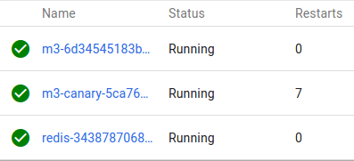

Finally, each RC is updated using a corresponding docker image from DockerHub, which in turn is built based on the push to GitHub branches:
  - Push to master branch -> build devopsm3:stable -> update m3 RC
  - Push to canary branch -> build devopsm3:canary -> update m3-canary RC

### REFERENCES

#### Kubernetes example
https://github.com/kubernetes/kubernetes/tree/master/examples/guestbook
